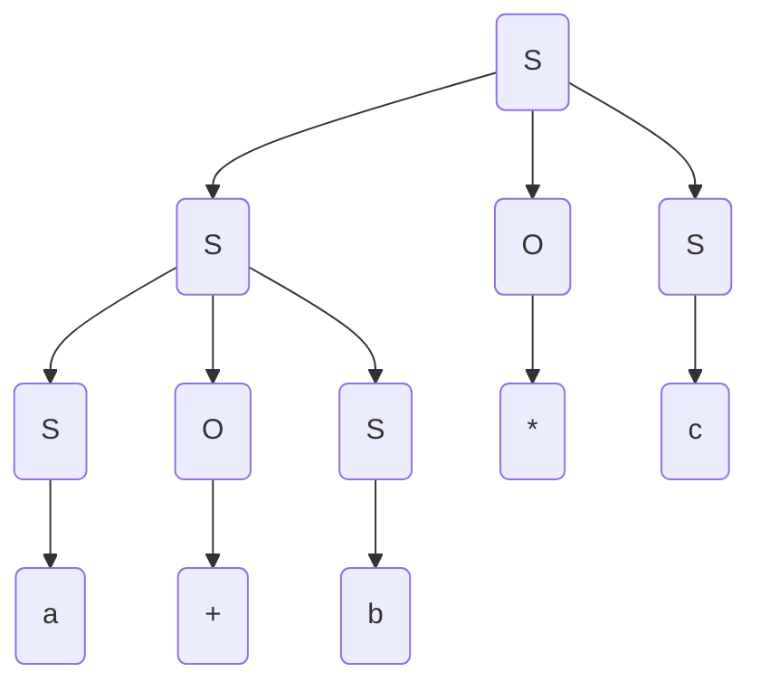
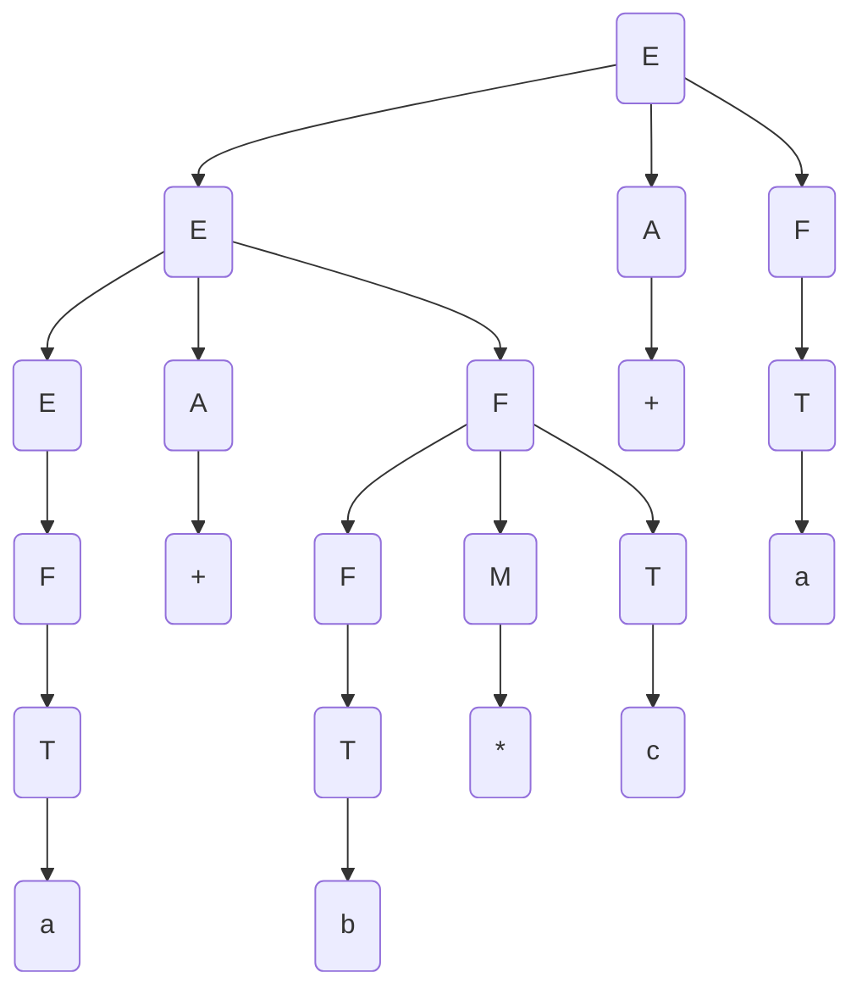

# Lecture 10

**Example:** $\Sigma_1=\{a,b,c,+,-,*,/\}$, $L_1=\{\text{arithemetic expressions on }\Sigma_1\}$. Call this $G_1$.

- $S\rightarrow a\,|\,b\,|\,c\,|\,SOS\,|\,(S)$
- $O\rightarrow +\,|\,-\,|\,*\,|\,/$

**Example**: Derive $a+b*c$ using the production rules above.
$$
\begin{align}
&S\Rightarrow SOS \Rightarrow SOSOS \Rightarrow aOSOS \Rightarrow a+SOS \Rightarrow\dots \Rightarrow a+b*c \tag{1}\\
&S \Rightarrow aOS \Rightarrow aOSOS \Rightarrow a+SOS\Rightarrow \dots \Rightarrow a+b*c \tag{2}
\end{align}
$$
There are many other ways to derive this. We need rules to standardize this, so we have things like:

*  **left most derivation** - always expand the left-most non-terminal
*  **right most derivation** - always expand the right-most non-terminal

However, even if we adhere to a rule above, we can choose different production rules at each step to reach the final result. So we have **ambiguity** in our grammar.

### Parse Trees

If we take $(1)$ from the example above, we have the following tree:



The tree for $(2)$ is:

```mermaid
graph TD
A(S)
B(S)
C(S)
D(O)
E(S)
F(S)
G(O)
H(a)
I(+)
J(b)
K(*)
L(c)
subgraph 
C-->E
C-->G
C-->F
E-->J
G-->K
F-->L
end
subgraph smoke trees
A-->B
A-->D
B-->H
D-->I
A-->C
end
```

---

We rewrite our production rules to have $G_2$:

* $E\rightarrow EOT\,|\, T$
* $ T \rightarrow a\,|\,b\,|\,c\,|\, (E)$
* $O\rightarrow +\,|\,-\,|\,*\,|\,/$

**Example:** $a+b+c$ gets evaluated as $(a+b)+c$. We evaluate it left to right

The parse tree is basically the same as the one for $(1)$. If we try it for $a+b*c$, it is wrong, because the addition would come before the multiplication.

To fix, we could try to have heuristics? We could modify the grammar to force precedence? The following is $G_3$

* $E\rightarrow EAF\,|\, F$
* $F\rightarrow FMT\,|\, T$
* $ T \rightarrow a\,|\,b\,|\,c\,|\, (E)$
* $A\rightarrow +\,|\,-$
* $M\rightarrow *\,|\,/$

**Example:** Try $a+b*c+a$:
$$
E\Rightarrow EAF \Rightarrow EAFAF \Rightarrow FAFAF \Rightarrow TAFAF \Rightarrow aAFAF \Rightarrow a+FAF \Rightarrow a+FMTAF \Rightarrow\dots
$$
Parse tree:



In the end we have made three different grammars $G_1, G_2, G_3$ and we have
$$
L(G_1) \equiv L(G_2) \equiv L(G_3)
$$
How do we show that grammars are the same? Take $x\in L(G_1)$ and show that it is in $L(G_2)$. Then take $y\in L(G_2)$ and show that it is in $L(G_1)$. This is very hard, and is **undecidable**.

---

**Recognizer:** What class of computer programs is needed to recognize CFLs?

* For regular languages, we use a DFA so we have finite states and memory use
* For CFLs, we use a DFA and stack. We use infinite memory but everything is in LIFO order

The problem of finding the derivation is called **parsing**. Given a grammar $G_1$, start symbol $S$ and terminal string $w$ which is the input, we have:
$$
S\,\underbrace{\Rightarrow\dots\Rightarrow\dots\Rightarrow\dots\Rightarrow}_{\text{we want to find this}}\, w
$$
Two choices we have to approach this:

* **Top-Down**: start with $S$, apply rules to get $w$
* **Bottom-Up**: start with $w$, work backwards to get to $S$

---

### Top-Down Parsing

* Start with $S$, apply grammar rules to get $w$
  $$
  S\Rightarrow\alpha_1\Rightarrow\alpha_2\Rightarrow\dots \Rightarrow w
  $$
  Use the stack to store the intermediate $\alpha_i$ in reverse, and match against chars in $w$.

  **Invariant:** consumed input $+$ $\text{Reverse(stack contents)} =\alpha_i$