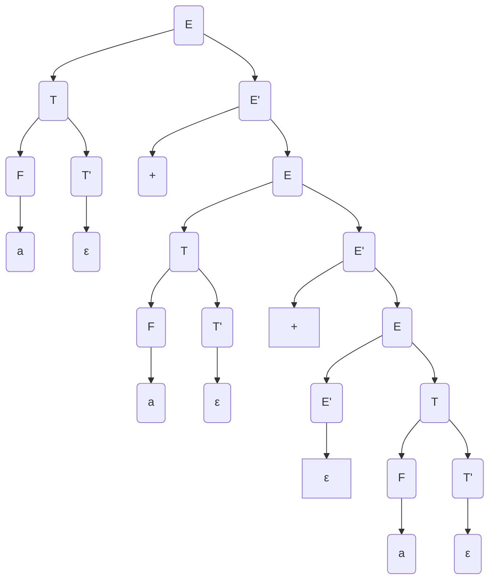
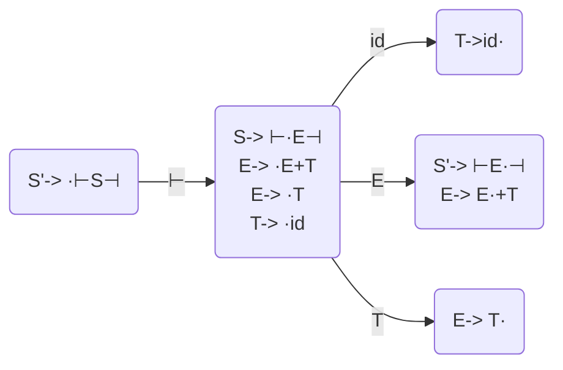

# Lecture 13

> A grammar is $LL(1)$ if:
>
> * No two distinct productions with the same LHS can generate the same first terminal symol
> * No nullable symbol $A$ has the same terminal symbol $a$ in both its $\text{First}$ and $\text{Follow}$ sets
> * There is only one way to send a nullable symbol to $\varepsilon$

**Example**

* $E\rightarrow E+T\,|\,T$
* $T\rightarrow T * F \,|\, F$
* $F\rightarrow a\,|\,b\,|\,c\,|\,(E)$

Is this $LL(1)$? No.

There is a choice in rule to use when looking at top of stack $E$ and next input symbol, if input is $a$:

* $E\Rightarrow T\Rightarrow F \Rightarrow a$
* $E \Rightarrow E+T \Rightarrow T+T \Rightarrow F+T \Rightarrow a+T$

We have two derivations to get the same first symbol, so not $LL(1)$. The key problem here is the *left recursion*: $E\rightarrow E+T$ vs $E\rightarrow T$. The $E$ on the left of the production rule can be recursively expanded, so we can get a terminal symbol in two different places. The same problem exists for *right recursion*. 

---

The following is $LL(1)$ by factoring out the various choices for different production rules:

* $E \rightarrow TE'$
* $E'\rightarrow \varepsilon \,|\, +E$
* $T\rightarrow FT'$
* $T' \rightarrow \varepsilon \,|\, *T$
* $F\rightarrow a\,|\,b\,|\,c$

This grammar is *right associative* (we don't want right associativity), given by the parse tree for $a+a+a$:

---

### Bottom-up Parsing

We want to go from $w$ to $S$, and we stack store each partially reduced info read so far:
$$
w \Leftarrow \alpha_k \Leftarrow \alpha_{k-1}\Leftarrow\dots \Leftarrow S
$$
**Invariant:** The stack and the entire unread input $=\alpha_i$ (or $w$ or $S$).

**Example:**

* $S' \rightarrow\; \vdash S \dashv$
* $S \rightarrow AyB$
* $A\rightarrow ab$
* $A \rightarrow cd$
* $B \rightarrow z$
* $B \rightarrow wx$

At each step:

1. We shift the character from input onto the stack
2. Reduce the top of stack in the RHS of a grammar rule and replace it with a LHS

|     **Stack**     |       **Read**        |        Unread         |                        **Action**                        |
| :---------------: | :-------------------: | :-------------------: | :------------------------------------------------------: |
|                   |     $\varepsilon$     | $\vdash abywx \dashv$ |                      shift $\vdash$                      |
|     $\vdash$      |       $\vdash$        |     $abywx\dashv$     |                        shift $a$                         |
|    $\vdash a$     |      $\vdash a$       |     $bywx \dashv$     |                        shift $b$                         |
|    $\vdash ab$    |      $\vdash ab$      |      $ywx\dashv$      | Reduce $A\rightarrow ab$ pop $b$, pop $a$, push $A$ |
|    $\vdash A$     |      $\vdash ab$      |      $ywx\dashv$      |      shift $y$ ($\vdash A$ doesn't match any rules)      |
|    $\vdash Ay$    |     $\vdash aby$      |      $wx\dashv$       |                        shift $w$                         |
|   $\vdash Ayw$    |     $\vdash abyw$     |       $x\dashv$       |                        shift $x$                         |
|   $\vdash Aywx$   |    $\vdash abywx$     |       $\dashv$        | Reduce $B\rightarrow wx$ pop $x$, pop $w$, push $B$ |
|   $\vdash AyB$    |    $\vdash abywx$     |       $\dashv$        |                     Reduce $S->AyB$                      |
|    $\vdash S$     |    $\vdash abywx$     |       $\dashv$        |                      shift $\dashv$                      |
| $\vdash S \dashv$ | $\vdash abywx \dashv$ |                       |          Reduce $S'\rightarrow \vdash S \dashv$          |
|       $S'$        | $\vdash abywx \dashv$ |                       |                          Accept                          |

We accept if the stack only contains $S'$ when the input is $\varepsilon$.

At each step, how do we know whether to shift or reduce:

* We can use the next character of input to help

> **Theorem:** (Donald Knuth, 1965)
>
> The set $\{wa\; |\; \exists x,S\Rightarrow^* wax\}$, where $w$ is the stack, $a$ is the next input character, is a regular language.

Since the set above is a regular language, it can be described by a DFA. We can then use a DFA to make the shift/reduce decisions. This creates a LR parsing method, we read left to right through input, and look at the right most derivations.

**Example:**

* $S' \rightarrow \; \vdash E \dashv$
* $E \rightarrow E+T$
* $E \rightarrow T$
* $T\rightarrow \text{id}$

**Definition:** An item is a production with a dot ($\;\boldsymbol{\cdot}\;$),  somewhere on the RHS (indicate partially completed rules).

* Label a transition with the symbol that follows the dot, and advance the dot in the next state
* If the dot precedes a non-terminal $A$, add all productions with $A$ on the LHS to the state (dot with the left-most position)

