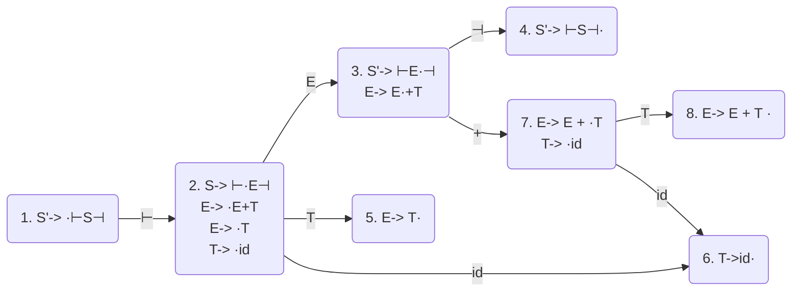
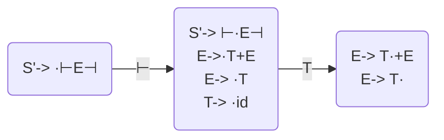

# Lecture 14

Example from last class cont.:

Reduce states only have one item (rule) and the dot is the right most.

When we having something at the top of the stack we want to pop and reduce, do the following:

* Pop the top of the stack, and backtrack one step in the DFA
* Put the reduced symbol onto the top of stack, and transition using the reduced symbol

For example at $T\rightarrow \text{id}\cdot\;$, we pop $\text{id}$ off the stack, go back along $\text{id}$, then push $T$ onto the stack, and follow the transition for $T$.

Once we backtrack everything, if only $S'$ is on the stack, and no more input is received, then we accept. To backtrack, we need to keep track of all the steps. So, we push the states onto the stack as well as the symbols.

**Example:** $\vdash id+id+id\dashv$

|         **Stack**          |           Read            |         Unread          |                            Action                            |
| :------------------------: | :-----------------------: | :---------------------: | :----------------------------------------------------------: |
|             1              |                           | $\vdash id+id+id\dashv$ |                 S2 (shift and go to state 2)                 |
|        $1\vdash 2$         |         $\vdash$          |    $id+id+id\dashv$     |                              S6                              |
|    $1\vdash 2\, id\,6$     |        $\vdash id$        |     $+id+id\dashv$      | Reduce $T\rightarrow id$, pop 1 symbol & 1 state Now in state 2, push $T$, go to state 5 |
|     $1\vdash 2\, T\,5$     |        $\vdash id$        |     $+id+id\dashv$      |                   Reduce $E\rightarrow T$                    |
|     $1\vdash 2\,E\,3$      |        $\vdash id$        |     $+id+id\dashv$      |                              S7                              |
|    $1\vdash 2\,E\,3+7$     |       $\vdash id +$       |      $id+id\dashv$      |                              S6                              |
| $1\vdash 2\,E\,3+7\,id\,6$ |     $\vdash id + id$      |       $+id\dashv$       |                   Reduce $T\rightarrow id$                   |
| $1\vdash 2\,E\,3+7\,T\,8$  |     $\vdash id + id$      |       $+id\dashv$       |                 Reduce $E\rightarrow E + T$                  |
|     $1\vdash 2\,E\,3$      |     $\vdash id + id$      |       $+id\dashv$       |                              S7                              |
|    $1\vdash 2\,E\,3+7$     |     $\vdash id + id+$     |       $id \dashv$       |                              S6                              |
| $1\vdash 2\,E\,3+7\,id\,6$ |    $\vdash id + id+id$    |        $\dashv$         |                   Reduce $T\rightarrow id$                   |
| $1\vdash 2\,E\,3+7\,T\,8$  |    $\vdash id + id+id$    |        $\dashv$         |                  Reduce $E\rightarrow E+T$                   |
|     $1\vdash 2\,E\,3$      |    $\vdash id + id+id$    |        $\dashv$         |                              S4                              |
|  $1\vdash 2\,E\,3\dashv4$  | $\vdash id + id+id\dashv$ |                         |            Reduce $S'\rightarrow \vdash E\dashv$             |
|           $1S'$            | $\vdash id + id+id\dashv$ |                         |                            Accept                            |

$LR(0)$ logic:

* If not a reduce state, simply shift and follow a transition for the symbol. If there is no transition, then error
* If we reduce, there is only 1 rule in that state

---

**What could go wrong here?**

What do we do if we have a state that is like $A\rightarrow \alpha \cdot c\beta, B\rightarrow \gamma\cdot\;$? Do we try to reduce, or do we try to shift to the next symbol? This is called a **shift-reduce conflict**, when we do no know what to do.

If we have a state like $A\rightarrow \alpha\cdot\;, A\rightarrow \beta\cdot\;$. This is a **reduce-reduce conflict**.

If any item with the dot at the end does not occur in a state by itself, then we have conflicts, and the grammar is not $LR(0)$.

**Example:** Right associative expressions

* $S'\rightarrow\vdash E \dashv$
* $E\rightarrow T+E$
* $E\rightarrow T$
* $T \rightarrow id$

We can see there is a shift-reduce conflict at the end.

**Example:** If input starts with $\vdash id \dots$

Input: (empty stack)$\rightarrow \;\vdash \;\rightarrow \;\vdash id\rightarrow$ Do we shift or reduce?

Cases:

* $\vdash id \dashv$ should reduce
* $\vdash id + id \dashv$ should shift

The choice depends on the next input symbol, so we add a lookahead to the automation to fix conflict. For each $A\rightarrow \alpha\cdot\;$, attach $\text{Follow}(A)$.

#### Resolving Conflicts

Note that $\text{Follow}(T)=\{+,\dashv\}$, and $\text{Follow}(E)=\{\dashv\}$. So when we are at the following state:
$$
\begin{align*}
&E\rightarrow T\cdot +E\\
&E\rightarrow T\cdot
\end{align*}
$$
If the follow is $+$, then we use the first rule. Similarly, if the follow is $\dashv$, then we use the second. Any symbol other than $+$ and $\dashv$ will give an `ERROR`.

> **Interpretation:** We have a reduce action $A\rightarrow \alpha\cdot\;X$, where $X=\text{Follow}(A)$. The action only applies when the next input symbol is in $X$. 

This result is called $SLR(1)$.