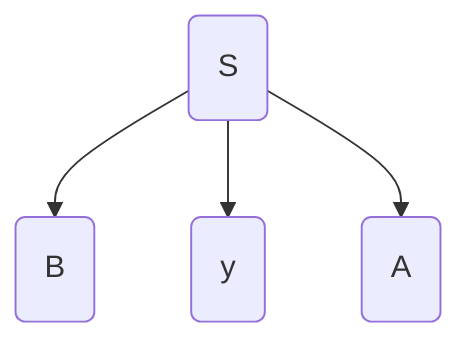
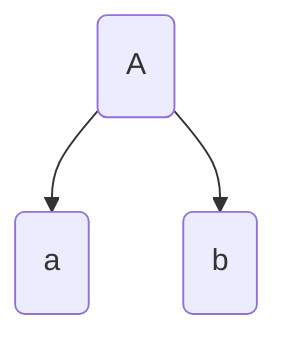
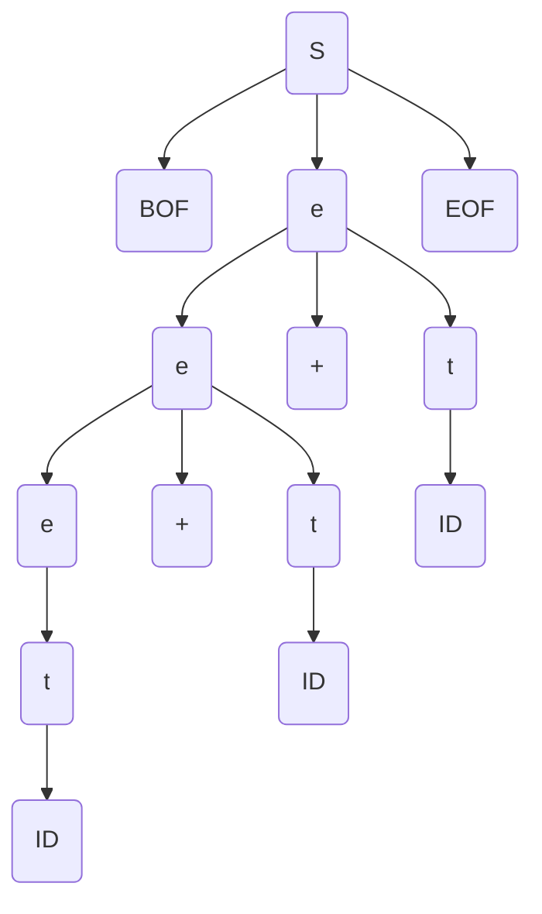
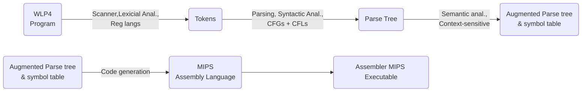

# Lecture 15

In the previous lecture we saw $SLR(1)$, where the $S$ is for simplified. $LR(1)$ is more complicated than $SLR(1)$, with more states etc. in its DFA. $LALR$ is "lookahead LR" which is between $LR(1)$ and $SLR(1)$ in terms of complexity. $LR$ still does not work for all grammars.

On assignments, the machines used for creating derivations is a series of lines in the following format:

```
State				Symbol (terminal/non-terminal)	  Shift/Reduce	    Next State/Production number
```

### Building the Parse Tree

**Example** During **Top-down parsing**, if we have $\dashv S$ on the stack, and we pop $S$, push $ByA$. We then have $\dashv ByA$ on the stack. The way the tree works is that what you pop is a parent node, and what we push become the children.



**Example** During **Bottom-up parsing**, if we have $\vdash ab$ on the stack, and a reduction rule $A\rightarrow ab$, we pop $ab$ and push $A$. We link what we popped with what we pushed. So we have:



The parser outputs a `wlp4i` file. So if we have the following grammar:

* `S -> BOF e EOF`
* `e -> e + t`
* `e -> t`
* `t -> ID`

And have input `BOF ID + ID + ID EOF`. The parse tree is:



Derivation is based on a pre-order traversal of the tree, we note the rules as well as the token along with their lexemes:

```
S BOF e EOF
BOF BOF
e e + t
e e + t
e t
t ID
ID a
+ +
t ID
ID b
+ +
t ID
ID c
EOF EOF
```

---

> **Recall: Context-free** means lets say we have $\alpha A\beta$, we can always just subsititute $A$ with any rule regardless of what is around it. The "context" does not matter.

### Context-Sensitive Analysis

What properties of C programs cannot be enforced by a CFG?

* Type checking (e.g. you cannot add 2 `int *`)
* Declarations before use (variables and functions)
* Function signatures
* Multiple declarations



