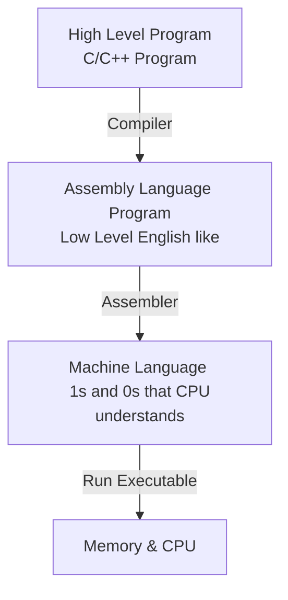

# Lecture 2

### Overview of a Program 



Computer programs operate on data, but are data themselves. The program and the data are stored in the same memory. This architecture is called the *von Neumann architecture*. 

This data is stored as binary sequences, as well as machine instructions. Only certain sequences are valid instructions, and they are processor specific. 

### CS241 Simplified MIPS

We have:

- A **CPU** that does all the work
- **Control Unit** decodes instructions, coordinate with other components to carry out the instruction

- Arithmetic Logic Unit (ALU)

- **Memory** - CPU registers and RAM. We only focus on these for this model

CPUs have a limited number of **registers**, small but fast memory storage locations. Our MIPS architecture has 32 registers, each 32 bits in size. The CPU can only operate on data stored in these registers, if the data is not in a register, then it must be loaded from the RAM. 

These registers are labelled `$0,$1,$2,...,$31`. `$0`is always 0, and cannot be changed. We also need $32 \rightarrow 2^5 \rightarrow  5$ bits to encode the location of a certain register.

#### MIPS Instruction Example - Add

> Add the contents of register `s` and `t`, and store the result in register `d`. 
>
> Assembly language: `add $d, $s, $t`. 
>
> Binary: `0000 00ss ssst tttt dddd d000 0010 0000`
>
> Do: `add $7, $8, $27` 

We know that 7 = 00111, 8 = 01000, and 27 = 11011 (5-bits), then the instruction in binary is:

`0000 0001 0001 1011 0011 1000 0010 0000`, 17 bits are remaining from the instruction apart from the register numbers. The CPU uses this to understand what instruction is being used - called the **OP Code**.

---

These instructions are very long, and are very tedious to write. Hence we will use **hexadecimal** (base 16) instead of binary.

* Digits: 0,1,2,…,9,a,b,c,d,e,f
* Each hexadecimal digit corresponds to 4 binary bits
* We denote hexadecimal numbers by starting with `0x`

The example `0000 0001 0001 1011 0011 1000 0010 0000` would translate into:`0x011b3820`

---

### RAM

- Big array of $n$ bytes ($n$ is large), away from the CPU 
- Each cell has an address 0, 1, 2, ..., $n-1$
- Each 4-byte block 4*k*, . . ., 4*k*+3 (for *k*=0,1,. . .) is a word 
- Words have addresses 0, 4, 8, c, 10, 14, 18, 1c, … (counting up by 4 in hex)
- Known as *word aligned*; i.e. divisible by 4 
- Data in RAM must be loaded into registers before the CPU can use them 

#### Communication

We have two operations: load and store.

Load transfers a word from a source address in RAM into a target register. The address is stored in the **Memory Address Register (MAR)**. The address then goes through the bus to the RAM, the data is returned on the bus and stored into the **Memory Data Register (MDR)**. The contents of the MDR is then moved to the target register. These registers are separate from the ones in general use.

Store just happens in reverse .

#### Code Execution

Since programs are stored in the RAM away from the CPU, how does the CPU know where the next instruction to execute is?

* A register called the **Program Counter (PC)** stores the memory address of the next instruction to execute
* An **Instruction Register (IR)** holds the current instruction

- A program needs a starting point, like `main()`. By convention, we guarantee that a specific address (such as 0) contains code

A **loader** puts the a program into memory and sets the address of the first instruction into the PC.

#### Fetch-Execute Cycle

What the computer really does is:

```assembly
PC <- 0
loop
	IR <- MEM[PC]		(load from RAM)
	PC <- PC + 4 (next instruction)
	Decode and execute what's in IR
end loop
```

What happens when the program ends though? Since the loader put the program into memory, when your program ends, the control should be passed back to the loader for the next program. Hence the memory address of the PC should be set to the **next instruction in the loader** when your program ends.

This instruction is set to `$31` by the loader. This is special, do not overwrite. To set the register, use the `jr` Jump Register instruction. As an example when a program ends:

```assembly
add $7, $8, $27
jr $31   (load the next program)
```

**Example: convert `jr $31` to hexadecimal:**

`jr` in binary is `0000 00ss sss0 0000 0000 0000 0000 1000`. Thus the instruction in binary is `0000 0011 1110 0000 0000 0000 0000 1000` as `31` is `11111`. Then, in hexadecimal it is: `0x3e00008`.

