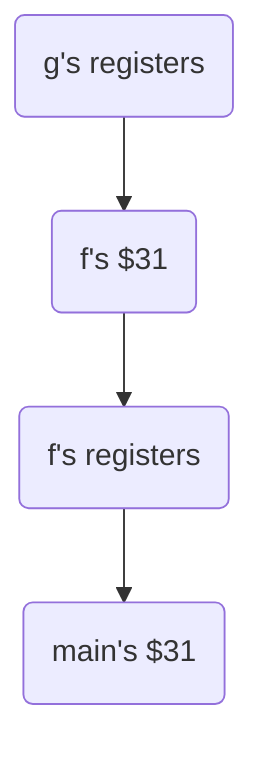

# Lecture 4

#### Notes About Labels:

When assigning a memory address to a line label: 

- Blank lines are simply stripped out. 
- Whitespace after labels is removed. 
- Only instructions (and .word) are assigned addresses. 
- A label is assigned the memory address of the instruction that follows it. 

* A label may appear at the end of your code and will be assigned the memory address of the word after your program. 

---

### Procedures in MIPS

Procedures in MIPS do not return any values, and all procs share the same set of registers on the CPU. Since everything shares registers, what if a caller has some important data on a register that the callee should not overwrite?

What we do is that when a procedure ends, the values in the registers should be the same as when the procedure was called. Essentially, the callee would save all the registers, do work, then restore all the values when it finishes. Usually, the data would be stored in the RAM, since register space is limited.

---

### Stack

When the loader allocates RAM for the program, it gives a block that's larger than the actual program. It sets the PC to 0, and `$30` is the memory address immediately after entire block. The stack the grows from the higher memory addresses to the low. 

If `f` calls `g`, then `g` calls `h`, then `f`'s stack is at the bottom, with `g`'s stack above it, and `h`'s stack is above `g`'s. The register `$30` always points to the very top of the stack, i.e. the highest memory address that is free. So if a stack is popped off, `$30` then moves to point to the top of the stack frame below it.

To store the registers, we use the store word instruction `sw`. For example, to store register `$1`, we can do `sw $1, -4($30)`. `$30` is the top of the stack, and so you want to use the free space above it, and you move `-4` upwards. Then, we have to decrement the `$30` by 4 to point to the new top of stack now. The order that things are inserted into the stack needs to be remembered.

#### Template for a Procedure

Supposed that a procedure `f` modifies registers `$1` and `$2`:

```assembly
f:
sw $1, -4($30)		; Push registers f modifies
sw $2, -8($30)
lis $2
.word 8
sub $30, $30, $2	; Decrement stack pointer
; Body of your procedure goes here
add $30, $30, $2 ; Assumes $2 is still 8
lw $2, -8($30)   ; Pop registers to restore
lw $1, -4($30)
; How do we return?
```

When exams ask you to write a procedure, you need to do the save and restore, whereas a question to write a program does not necessarily need to do so.

Let's say that `f` from above gets called from `main`:

```assembly
main:
  lis $5
  .word f
  jr $5

f: ...
```

But how do we know where `f` should return to? We use the `jalr` instruction. `jalr` sets `$31` to the PC, and then it sets the PC to the memory address of the first line of `f`. So now the address that shoudl be executed after `f` is done is saved in `$31`, and we `jr $31` to return from `f`. 

However, `$31` needs to be saved before `jalr` is called. So our new `main` template looks like:

```assembly
main:
  lis $5
  .word f
  sw $31, -4($30)			; Push $31
  lis $31
  .word -4
  add $30, $30, $31		; Decrement top of stack
  jalr $5							; Jump to f
  lis $31							; Pop to restore $31
  .word 4
  add $30, $30, $31		; Increment top of stack
  lw $31, -4($30)
  jr $31							; Return to loader
f:
	sw $1, -4($30)		; Push registers f modifies
  sw $2, -8($30)
  lis $2
  .word 8
  sub $30, $30, $2	; Decrement stack pointer
  ; Body of your procedure goes here
  add $30, $30, $2 ; Assumes $2 is still 8
  lw $2, -8($30)   ; Pop registers to restore
  lw $1, -4($30)
  jr $31					 ; Return
```

Each time you call something, the `$31` for that scope needs to be saved, so if `main` calls `f` which calls `g`, then we have:



### Parameter and Result Passing

The simple approach is to document what each register is storing. For example, for a procedure `sumEvens2ToN`:

```assembly
; sumEvens2ToN: adds all even numbers from 2 .. N
; Registers:
;   $1 - Temporary work
;   $2 - Input (value of N)
;   $3 - Output
```

In this example, `$1` and `$2` should/must be saved since they may contain data that the caller needs. However, we never save `$3` since it is the output that is passed back to the caller. If we save and restore `$3` then there is no way for the caller to get the output.

---

### Printing to Stdout

Use `sw` to store a word in address `0xffff000c`. Least significant byte will be printed to `stdout`. For example, to print out `"CS\n"`:

```assembly
lis $1
.word 0xffff000c
lis $2
.word 67  ; ASCII 'C'
sw $2, 0($1)
lis $2
.word 83  ; ASCII 'S'
sw $2, 0($1)
lis $2
.word 10  ; ASCII '\n'
sw $2, 0($1)
jr $31
```

### Reading from Stdin

Use `lw` to store a word in address `0xffff0004`. Least significant byte will be printed to `stdin`.