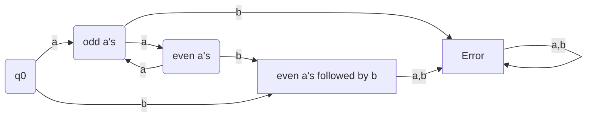

# Lecture 6

###Formal Languages

**Definitions:**

* **Alphabet** - non-empty finite set of symbols, denoted $\Sigma$.
  * like $\Sigma=\{a,b,c\}$
* **String** (or **word**) - finite sequence of symbols from $\Sigma$.
  * Length of a string $w$ is $|w|$
  * The empty string is denoted by $\epsilon$, and $|\epsilon|=0$
  * If $\epsilon$ is the empty string (not a char), and $\Sigma=\{a\}$, is $a=\epsilon a\epsilon$? Yes, since $\epsilon$ does not have any characters
* **Language** - set of strings.
  * $\{\}$ or ∅
  * $\{\epsilon\}$ is a singleton set, since the entire language only has 1 string
  * $\{\epsilon\} =\{\epsilon,\epsilon\epsilon\}$, since $\epsilon\epsilon=\epsilon$

---

If we want to check whether a given string belongs to a language, it depends on how complex the language is. This difficulty of recognition creates a hierarchy of language classes.

A very simple program to check if a string is in a language is to go character by character, with if-else statements of all possible letter combinations to form strings that are in the language.

### Building Regular Languages Together

Every finite language is regular.

* **Union**: $L_1\cup L_2 = \{x:x\in L_1 \text{ or } x\in L_2\}$
* **Concatenation**: $L_1\cdot L_2 = L_1L_2 = \{xy:x\in L_1,y\in L_2\}$
* **Kleene Star**: $L^*$ is the set of all strings consisting of 0 or more occurences of strings from $L$ concatenated together
* $\Sigma^*$ is all strings possible composed of alphabet symbols, and $\epsilon$. It is a language

#### Regular Expressions

These are expressions that make languages easier to work with as set notation is cumbersome. Operators on these expressions have precedence.

If $E$ is an expression, then $L(E)$ is the language of this expression.

#### Formal languages

Let $L = \{a^{2n}b\}$, is it regular? Here's how we break it down:

*  $\{a^{2n}\}\{b\}$
* $(\{a\}\{a\})^*\{b\}$

Regular expresssion: $(aa)^*b$

---

### Deterministic Finite Automata (DFA)

Formally, a DFA $M$ is a 5-tuple $M=(\Sigma, Q, q_0, A, \delta)$, where:

* $\Sigma$ is a non-empty finite alphabet
* $Q$ is a non-empty finite set of states
* $q_0$ is the start state
* $A \subseteq Q$ is a set of accepting states
* $\delta: (Q\times E) \rightarrow Q$ is a transition function
  * Given a current state and an input, go to the next state

DFA $M$ for determining if a string is in $(aa)^*b$:

The language of $M$ is denoted $L(M)$, which is the set of strings accepted by $M$.

The extended transition function $\delta^*$ applies the standard transition function on each char in a word, until the word is finally $\epsilon$:

* Base case: $\delta^*(q, \epsilon) = q$
* Recursive case: $\delta^*(q, cw) = \delta^*(\delta(q,c),w)$, where $c\in\Sigma$ and $w\in\Sigma^*$. So $cw$ is a non-empty string.