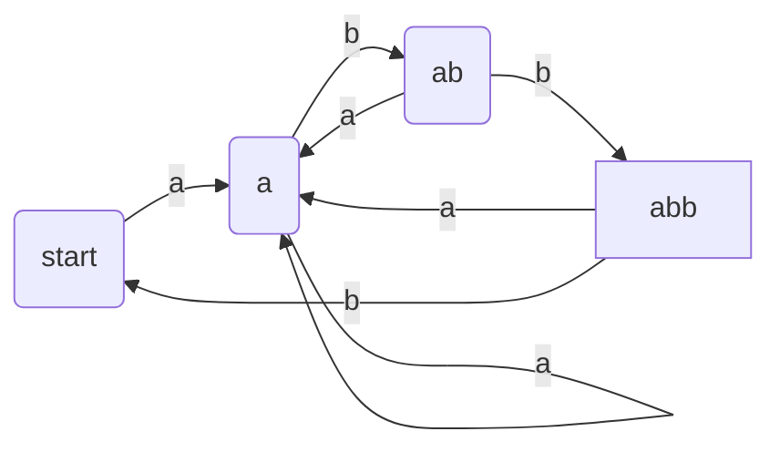
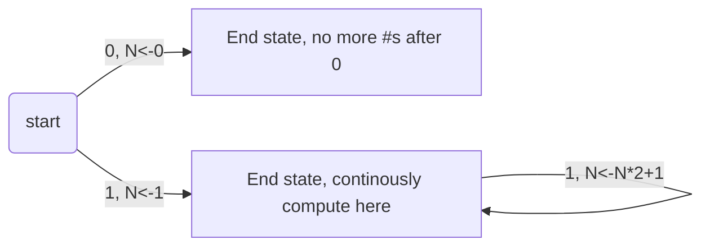
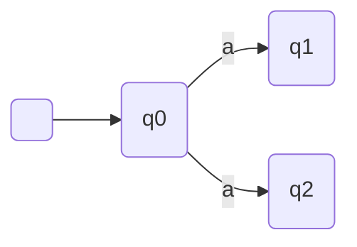
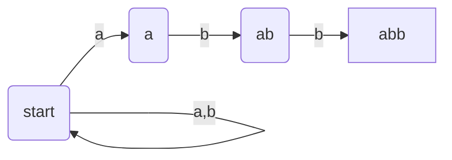
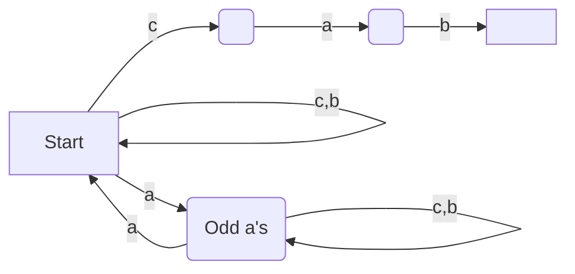
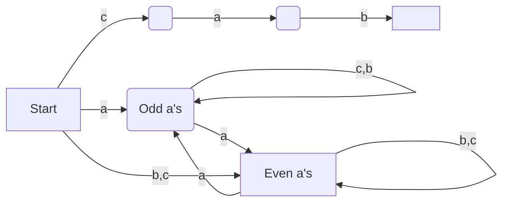

# Lecture 7

**Example:** $\Sigma=\{a,b\}$. Draw a DFA for $L=\{w\in\Sigma^*,w\text{ ends in }abb\}$.

#### DFAs with Actions

**Example:** Let $L=\{\text{Binary numbers with no leading 0s}\}$. Then $\Sigma=\{0,1\}$. We want to simultaneously compute the number in decimal as well, let that be $N$.

In CS241 we want a DFA for recognizing tokens, and emite token with lexeme.

---

> **Kleene's Theorem**
>
> A language $L$ is regular $\Leftrightarrow$ $L=L(M)$ for some DFA $M$.

$L(M)$ denotes the language of automata $M$.

### Nondeterministic Finite Automata (NFA)

An NFA allows more than 1 transition on a given alphabet symbol from a state.

Example from top of page as a NFA:

At the beginning, if we have an `a`, which path to we take? Do we go to the next `a`, or cycle on start? The answer is we take both paths, and if we take both, we are sure to eventually go on the right path. This becomes the N vs NP problem.

Formally, a NFA $M$ is a 5-tuple $M=(\Sigma, Q, q_0, A, \delta)$, where:

- $\Sigma$ is a non-empty finite alphabet
- $Q$ is a non-empty finite set of states
- $q_0$ is the start state
- $A \subseteq Q$ is a set of accepting states
- $\delta: (Q\times E) \rightarrow$ Subset of $Q$, we have $2^{|Q|}$ possible subsets.

**Example:** $L=\{cab\text{ or strings with an even number of $a$'s}\}$, $\Sigma=\{a,b,c\}$.

The machine created is just a combination of a machine that takes even $a$'s and a $cab$ machine. In the machine above however, the string $aacab$ is accepted. However, it creates a branch between the even $a$ machine and the $cab$ machine. We fix this by:

