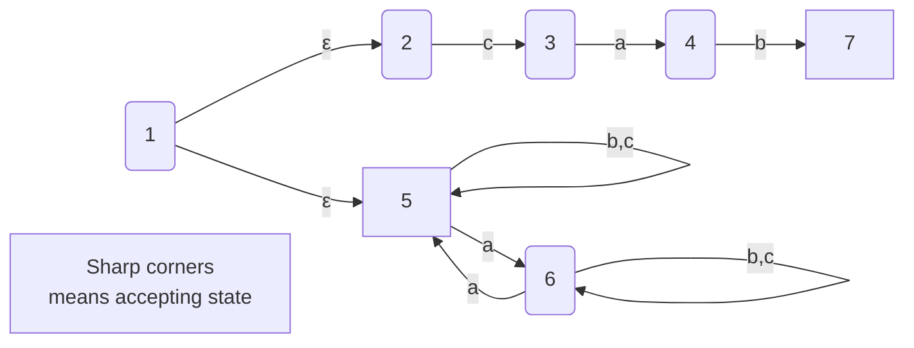
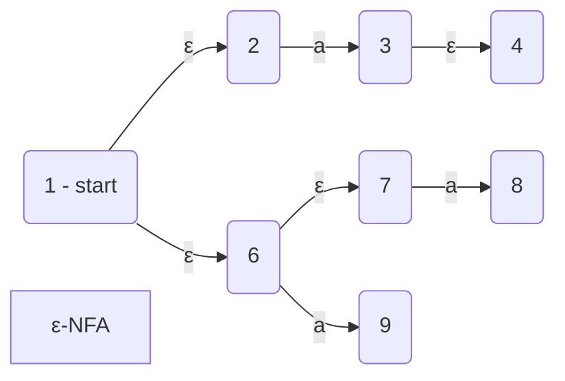
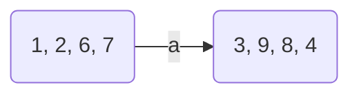
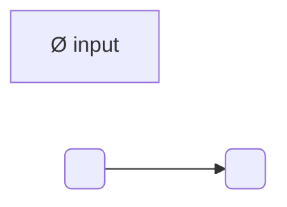
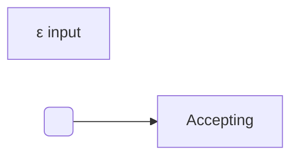
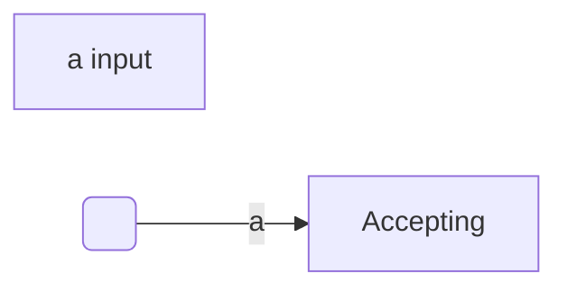
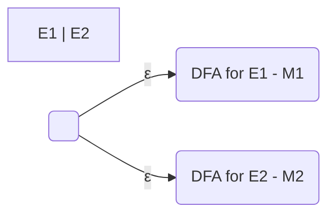
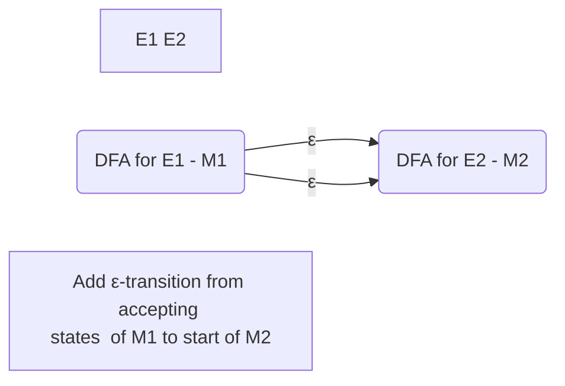
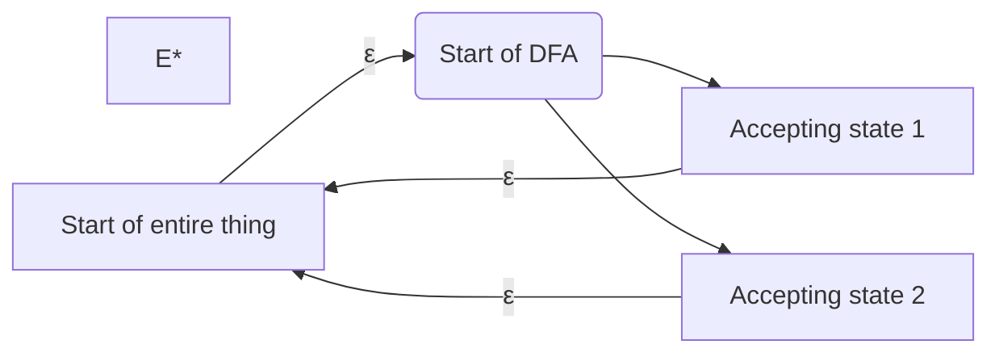
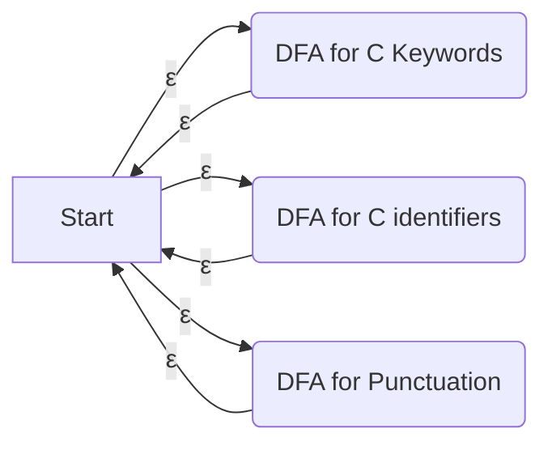

# Lecture 8

#### $\varepsilon$-NFA

We can have $\varepsilon$ transitions, which are transitions that consume $\varepsilon$, the empty string. What this does is that we can break down two separate pieces of an NFA as 2 parts of an $\varepsilon$ transition. This removes the possibility of going from one machine to another as part of an NFA.

**Example:** $L=\{cab\}\cup \{\text{even number of $a$'s}\}$, $\Sigma=\{a,b,c\}$



| Trace: Read | Not Read | States     |
| ----------- | -------- | ---------- |
| ε           | caba     | 1,2,5      |
| c           | aba      | 3,5        |
| ca          | ba       | 4,6        |
| cab         | a        | 7,6        |
| caba        | ε        | 5 - Accept |

Converting an NFA to a DFA is like tracing through all the possible states to be in for the NFA, and creating a state in the DFA for that. Then, we connect all the possible states with the possible transitions between them.

**Example:** $\varepsilon$-NFA to DFA

We need to consider:

* What are the states we can start in
* Where can we go from {1} on a,b,c? Where from {5} on a,b,c?



The possible starting states are: 1, 2, 6, 7. From those states, if we get an $a$, we go into states 3, 9, 8, 4.

> **Definition**
>
> Let $S$ be a subset of states of an NFA. The **$\text{ε-closure}(S)$** is the set of all states reachable from a state in $S$ by 0 or more ε-transitions.

So, $\text{ε-closure}({3, 9, 8}) = \{3, 9, 8, 4\}$. In the DFA, we can have:



Still using the example above, if we want $\text{ε-closure}(1)$, we have:
$$
\{1\}\Rightarrow\{1, 2, 6\}\Rightarrow\{1,2,6,7\}\Rightarrow\{1,2,6,7\}
$$
Once we reach the steady state {1, 2, 6, 7}, then that is the ε-closure.

---

> **Another Kleene's Theorem**
>
> Regular expressions can be converted to a ε-NFA, which in turn can be converted to a DFA.

We have for different inputs:













---

### Is C a regular language?

Since all the components that make up a C program are regular, so the union of all these components is also regular. So the language $L=\{\text{Valid C tokens}\}$ is regular. $LL^*$ is the language of non-empty sequences of C tokens. 

However, this does not mean that things in $LL^*$ is a valid C program. We do note though, that all valid C programs are a subset of $LL^*$. So, are subsets of regular languages regular?

No. They are not. For example, if we have $O^*$, and a subset is $O^i$, where $i$ is prime. If we want a DFA for $O^i$, we need to go through infinitely many states, since there are infinite prime numbers, with no pattern to generate them. Hence $O^i$ is not regular.

A possible DFA for $LL^*$:



From the start state, do an $\varepsilon$ transition to all "tokens" for C. Then from the accepting state of each, transition back to the start for $LL^*$.

---

###Unique Decomposition

The following is an $\varepsilon$-NFA for valid C identifiers:


We emit the token, and return to the start state to start recognizing the next token. However, when should be take the $\epsilon$-transition? If we give $abcd$ to this NFA, we can get:

* $a,b,c,d$
* $a,b,cd$
* $a,bc,d$
* $\cdots$

So to prevent this, we try to only transition when we have the longest possible token. This is also a problem. Example: $L=\{aa,aaa\}$, and let an input string $w=aaaa$. If we just choose $aaa$, then we have an $a$ left over, and the program will crash even though its valid.

```C
int a = 2;
int b = 3;
a+++b;			// works 
a+++++b;		// does not work since ++ returns an lvalue, and you can't do ++ on an lvalue
```
