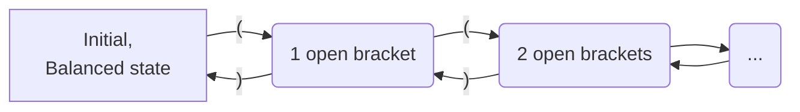

# Lecture 9

### Maximal Munch Algorithm

- Run the DFA without $\epsilon$ transitions until we only have error transitions left
- If we end up in an accepting state, emit the token 
- Otherwise, backtrack to the most recently seen accepting state, emit, and resume
- FInally, do an $\epsilon$-transition back to the start

This is a good algorithm and all, but yanno them compilers wanna be fast and shit, so we have the following.

### Simplified Maximal Munch Algorithm

* Run the DFA without $\epsilon$ transitions until we only have error transitions left
* If we end up in an accepting state, emit the token, and do an $\epsilon$-transition back to the start
* Otherwise, give the mans an `ERROR`

#####Example: Create a DFA for $\Sigma=\{(,)\}$, and $L=\{\text{strings of balanced parentheses}\}$

Here, each state represents the number of open brackets. However, since we do not have a limit on the number of brackets, we are going to have infinite states. DFAs only have finite states. Hence, we **cannot** use a DFA for this.

---

### Context-Free Languages

These are languages that can be described by a **context-free grammar**, essentially a set of rewriting rules.

Let $S$ be a placeholder for a string (non-terminal symbol) with balanced parentheses, then all strings with balanced parenthesis can be made by the following **production rules**:

* $S\rightarrow (S)$
* $S \rightarrow \epsilon$
* $S\rightarrow SS$

For example, "(())" can be made by
$$
S\rightarrow(S) \rightarrow((S)) \rightarrow((\epsilon))\rightarrow(())
$$

### Context-Free Grammars (CFG)

Formally, a CFG $G$ is a 4-tuple $G = (Σ, N, P, S)$

- $Σ$ - non-empty, finite alphabet of *terminal* symbols 
- $N$ - non-empty, finite set of *non-terminals* (often also called *variables*) 
- $P$ - a finite set of production rules of the form: $A → β$ where $A ∈ N, β ∈ (N ∪ Σ)^∗ $
- $S$ - a start non-terminal, $S ∈ N$

> $(N ∪ Σ)$ is used a lot, and we denote it by $V$ for "vocabulary".

The production rules from above for balanced parentheses can be written as $S\rightarrow (S)\,|\,\epsilon \,|\,SS$. The right hand side have a mix of terminal and non-terminal symbols. Hence they are part of the vocabulary and are of the form $V^*$.

---

### Derivations

The application of a production rule is called a **derivation**. We use the symbol $\Rightarrow$.

* $\alpha\Rightarrow\beta$, $\beta$ can be derived from $\alpha$
* $\alpha\Rightarrow^k\beta$, $\beta$ can be derived from $\alpha$ after $k$ derivations
* $\alpha\Rightarrow^*\beta$, $\beta$ can be derived from $\alpha$ after 0 or more derivations

#### Intermediate Forms

Intermediate steps may have the form:
$$
\alpha A\beta \Rightarrow\alpha\gamma\beta\text{ if there is a production } A\rightarrow\gamma \text{ in }P
$$

> The **language** of a CFG $G$ is the set of strings (terminals only) that we can be derived from the starting non-terminal $S$
> $$
> L(G)=\{w\in\Sigma^*|S\Rightarrow^*w\}
> $$

**Example:** CFG for palindromes where $\Sigma=\{a,b,c\}$

Production rules:

* $S\rightarrow\epsilon$
* $S\rightarrow a\,|\,b\,|\,c$
* $S\rightarrow aSa\,|\,bSb\,|\,cSc$

**Example:** $\Sigma_1=\{a,b,c,+,-,*,/\}$, $L_1=\{\text{arithemetic expressions on }\Sigma_1\}$.

* $S\rightarrow a\,|\,b\,|\,c\,|\,SOS\,|\,(S)$

* $O\rightarrow +\,|\,-\,|\,*\,|\,/$